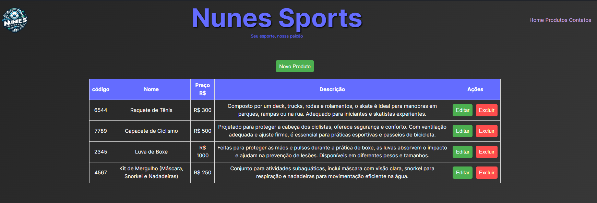

# Sistema de gestão de produtos - Nunes Sports
Projeto desenvolvido para processo seletivo na   Everymind


O Sistema de Cadastro de Produtos da NunesSports é uma solução dinâmica e eficiente projetada para facilitar a gestão de inventário de produtos esportivos. Desenvolvido com foco na usabilidade e na eficiência operacional, nosso sistema permite que administradores e gestores de lojas esportivas gerenciem seu inventário com facilidade, precisão e flexibilidade.

### Funcionalidades Principais
- Cadastro de produtos
- Edição de produtos
- Exclusão de produtos
- Listagem de produtos


# 🛠️ construído com

* [Vite - Vanilla TS](https://pt.vitejs.dev/guide/) - Build tool
* [Xano](https://docs.xano.com/) - Banco de dados
* [Vercel](https://vercel.com/) - Deploy

## 🚀 Começando
Essas instruções fornecerão uma cópia do projeto em execução na sua máquina local para fins de desenvolvimento e teste.

### Pré-requisitos
O que você precisa para instalar o software e como instalá-lo:

Clone o repositório
```sh 
git clone git@github.com:mbrennerr/Project_NunesSports.git
```
Instale as dependências
```sh
npm install
```
Inicie o servidor
```sh
npm dev
```
---
### Layout da estrutura do projeto
```
├──everymind_app_ts
├── src
│   ├── api
│   │   ├── apiproducts.ts
│   ├── assets
│   ├── components
│   │   ├── Buttons.ts
│   │   ├── Modal.ts
│   │   ├── ProductForm.ts
│   │   ├── Table.ts
│   ├── services
│   │   ├── ProductService.ts
│   ├── Style
│   │   ├── style.css
│   │   ├── modal.css
│   ├── Types.ts
│   ├── utils.ts
│   │   ├──handleProductSubmit.ts
│   │   ├──modalUtils.ts
│   │   ├──refreshProducts.ts
│   │   ├──updateTable.ts
│   ├── main.ts
index.html
```
### Layoutr do projeto


